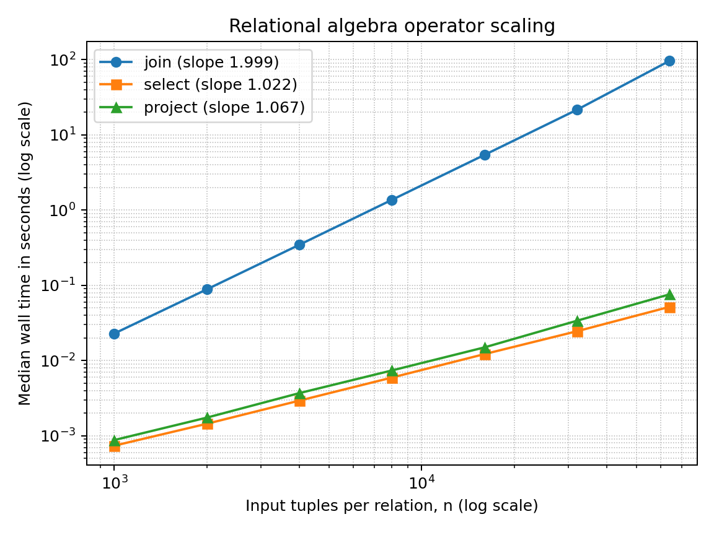

# Performance Study

## Environment and method

- Machine: MacBook Air, Apple M2, 8 CPU cores, 16 GB memory, arm64.
- Operating system: macOS 15.6.
- Language: Python 3.11.7 (CPython).
- Clock: `time.perf_counter()`.
- Main data: generated `R(a,b)` and `S(b,c)`, with `n=m` and match rate 1.
- Queries: `R join[R.b=S.b] S`, `select[a>=0](R)`, and `project[a](R)`.
- Repetitions: three per operator and size; the median is reported.
- Timing boundary: query evaluation only. Data generation, relation parsing,
  and query parsing are excluded.

The generator makes `a` and `c` unique and controls repetitions of `b`, so the
match-rate-one experiment produces exactly `n` distinct join tuples. Every row
below came from `performance_results.json`; none is estimated.

## Measurements

| n | m | join comparisons | join median (s) | output tuples | select median (s) | select examined | project median (s) |
|---:|---:|---:|---:|---:|---:|---:|---:|
| 1,000 | 1,000 | 1,000,000 | 0.022885 | 1,000 | 0.000738 | 1,000 | 0.000876 |
| 2,000 | 2,000 | 4,000,000 | 0.088468 | 2,000 | 0.001443 | 2,000 | 0.001741 |
| 4,000 | 4,000 | 16,000,000 | 0.346399 | 4,000 | 0.002931 | 4,000 | 0.003689 |
| 8,000 | 8,000 | 64,000,000 | 1.371550 | 8,000 | 0.005938 | 8,000 | 0.007384 |
| 16,000 | 16,000 | 256,000,000 | 5.425683 | 16,000 | 0.012176 | 16,000 | 0.014956 |
| 32,000 | 32,000 | 1,024,000,000 | 21.626364 | 32,000 | 0.024530 | 32,000 | 0.033837 |
| 64,000 | 64,000 | 4,096,000,000 | 96.665575 | 64,000 | 0.051713 | 64,000 | 0.075909 |



The least-squares slopes of `ln(time)` against `ln(n)` across all seven points
are 1.9989 for join, 1.0223 for select, and 1.0675 for project.

## 1. Relationship among n, m, and comparisons

The exact comparison count is

```text
C(n,m) = n * m.
```

The outer loop visits every tuple of `R`; for each one, the inner loop visits
every tuple of `S` and increments the join's counter once before testing the
condition. At 64,000 by 64,000, the measured counter is exactly
`64,000 * 64,000 = 4,096,000,000`. Every size matched the formula exactly.
Match rate does not enter this formula because the engine cannot know whether a
pair matches until it evaluates that pair.

## 2. Log-log slope

The join slope is **1.9989**, effectively 2. With `n=m`, the formula becomes
`C(n,n)=n^2`; therefore doubling `n` quadruples the comparisons and should
roughly quadruple time. For example, the median rises from 5.425683 seconds at
16,000 to 21.626364 seconds at 32,000, a factor of 3.986. The slope and direct
ratio both support quadratic time, `Theta(n^2)`, for this nested-loop join.

## 3. Select and project versus join

Select has slope **1.0223** and project has slope **1.0675**, both close to 1.
Select examines each of `n` input tuples once, and its counter equals `n`
exactly. Project also visits each tuple once and inserts its projected form into
the engine's explicit deduplication structure. With the generated unique `a`
values, those insertions have no duplicate-heavy bucket. Both curves are
therefore linear, `Theta(n)`, rather than the join's `Theta(n^2)`. At 64,000,
select takes 0.051713 seconds and project 0.075909 seconds, versus 96.665575
seconds for join.

## 4. Prediction for one million tuples on each side

Using the largest measured point and the measured quadratic relationship:

```text
T(1,000,000)
  = T(64,000) * (1,000,000 / 64,000)^2
  = 96.665575 * 15.625^2
  = 96.665575 * 244.140625
  = 23,599.994 seconds
  = 6.556 hours.
```

This is a prediction, not a run. It assumes the per-comparison cost remains
similar at the larger size, which is reasonable for the tight loop but can be
perturbed by system load, memory hierarchy, and output size.

## 5. Effect of match rate

I held `n=m=8,000`, used three repetitions per rate, and changed only the
generator's requested match rate.

| match rate | comparisons | output tuples | median time (s) |
|---:|---:|---:|---:|
| 0 | 64,000,000 | 0 | 1.343562 |
| 1 | 64,000,000 | 8,000 | 1.365570 |
| 4 | 64,000,000 | 32,000 | 1.414912 |
| 16 | 64,000,000 | 128,000 | 1.626175 |

The comparison count does not change: it is exactly 64,000,000 in every row
because nested loops still inspect the full Cartesian pair space. Wall time
does change. More matches cause more output tuples to be concatenated, hashed,
checked with the engine's equality routine, and stored. That extra output work
raises the median by about 21% from rate 0 to rate 16 even though comparisons
remain fixed.

## 6. Making the million-tuple join feasible

I would replace the nested-loop equality join with a hash join: scan the
smaller input once to build a hash table keyed by its join attribute, then scan
the other input and probe the table for matches. With adequate memory, its
expected work is `Theta(n + m + k)`, where `k` is the number of output tuples,
instead of `Theta(n*m)`. If the build side did not fit in memory, I would
partition both relations by a hash of the join key and process corresponding
partitions one pair at a time. The counter and benchmark would also need to
distinguish build/probe operations from pair comparisons. This describes a
future change only; the submitted engine retains the required nested loops.

